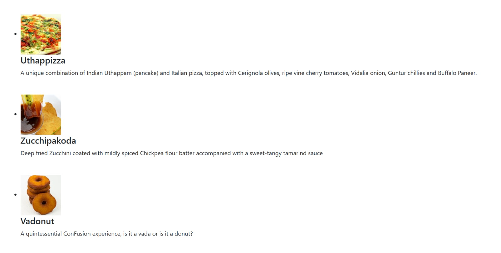
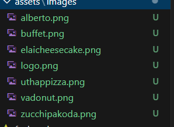

# Documentação do Componente `Menu`
---
## Descrição

Este arquivo define um componente React funcional chamado `Menu`, que utiliza o **Reactstrap** para renderizar uma lista de pratos (dishes) em formato de mídia (Media Object). Ele exibe informações detalhadas sobre cada prato, como nome, imagem, categoria, preço e descrição.

---

## Estrutura do Componente

### Importações
- **React e useState**: Para criar o componente funcional e gerenciar o estado dos pratos.
- **Media**: Um componente fornecido pela biblioteca **Reactstrap**, usado para criar layouts de mídia.

### Dados (Estado `dishes`)
Os dados dos pratos são armazenados no estado do componente `Menu` e incluem os seguintes atributos para cada prato:
- `id`: Identificador único do prato.
- `name`: Nome do prato.
- `image`: Caminho para a imagem do prato.
- `category`: Categoria (ex.: mains, appetizer, dessert).
- `label`: Rótulo adicional (ex.: Hot, New).
- `price`: Preço do prato.
- `description`: Descrição detalhada do prato.

Os pratos são definidos como um array imutável utilizando o React Hook `useState`.

### Renderização
1. **Mapeamento dos pratos**:
   O método `.map()` é utilizado para iterar sobre o array `dishes`, retornando um JSX com os dados de cada prato.

2. **Estrutura do Media Object**:
   - **Media esquerda**: Contém a imagem do prato.
   - **Media corpo**: Inclui o nome do prato (como título) e sua descrição.

3. **Renderização Final**:
   A lista de pratos é encapsulada dentro de uma estrutura de `container` e `row` fornecida por classes do Bootstrap.

---

## Código

```javascript
import React, { useState } from 'react';
import { Media } from 'reactstrap';

const Menu = () => {
    const [dishes] = useState([
        {
            id: 0,
            name: 'Uthappizza',
            image: 'assets/images/uthappizza.png',
            category: 'mains',
            label: 'Hot',
            price: '4.99',
            description: 'A unique combination of Indian Uthappam (pancake) and Italian pizza, topped with Cerignola olives, ripe vine cherry tomatoes, Vidalia onion, Guntur chillies and Buffalo Paneer.'
        },
        {
            id: 1,
            name: 'Zucchipakoda',
            image: 'assets/images/zucchipakoda.png',
            category: 'appetizer',
            label: '',
            price: '1.99',
            description: 'Deep fried Zucchini coated with mildly spiced Chickpea flour batter accompanied with a sweet-tangy tamarind sauce'
        },
        {
            id: 2,
            name: 'Vadonut',
            image: 'assets/images/vadonut.png',
            category: 'appetizer',
            label: 'New',
            price: '1.99',
            description: 'A quintessential ConFusion experience, is it a vada or is it a donut?'
        },
        {
            id: 3,
            name: 'ElaiCheese Cake',
            image: 'assets/images/elaicheesecake.png',
            category: 'dessert',
            label: '',
            price: '2.99',
            description: 'A delectable, semi-sweet New York Style Cheese Cake, with Graham cracker crust and spiced with Indian cardamoms'
        }
    ]);

    const menu = dishes.map((dish) => {
        return (
            <div key={dish.id} className="col-12 mt-5">
                <Media tag="li">
                    <Media left middle>
                        <Media object src={dish.image} alt={dish.name} />
                    </Media>
                    <Media body className="ml-5">
                        <Media heading>{dish.name}</Media>
                        <p>{dish.description}</p>
                    </Media>
                </Media>
            </div>
        );
    });

    return (
        <div className="container">
            <div className="row">
                <Media list>
                    {menu}
                </Media>
            </div>
        </div>
    );
};

export default Menu;
```
---
Tecnologias Utilizadas
React: Biblioteca principal para construção da interface.

Reactstrap: Biblioteca de componentes para estilização baseada no Bootstrap.

Bootstrap: Usado para a estilização através de classes CSS como container, row, e col-12.

Pontos de Extensão

Adicionar novas categorias: Pode-se expandir o array dishes com novas categorias ou pratos.

Melhorar acessibilidade: Incluir atributos de acessibilidade (ex.: alt mais descritivo nas imagens).

Customização do estilo: Aplicar estilos personalizados para diferenciar os elementos visualmente.

Saída Esperada

O componente Menu renderiza uma lista vertical de pratos, com imagem à esquerda e informações textuais à direita. Ele é responsivo e fácil de modificar para adicionar novos pratos ou categorias.

# DOCUMENTAÇÃO DO COMPONENTE `MENU`
---
## DESCRIÇÃO

ESSE CÓDIGO DEFINE UM COMPONENTE **REACT** CHAMADO `MENU`, QUE USA **REACTSTRAP** PRA RENDERIZAR UMA LISTA DE PRATOS (DISHES). ELE MOSTRA O NOME, IMAGEM, CATEGORIA, PREÇO E DESCRIÇÃO DE CADA PRATO, TUDO ORGANIZADO BONITO.

---

## ESTRUTURA DO COMPONENTE
---
### IMPORTAÇÕES
- **REACT E USESTATE**: PRA CRIAR O COMPONENTE FUNCIONAL E GUARDAR OS PRATOS NO ESTADO.
- **MEDIA**: COMPONENTE DO **REACTSTRAP** PRA FAZER LAYOUT DE OBJETOS DE MÍDIA.
---


### DADOS (ESTADO `DISHES`)
OS PRATOS ESTÃO NUM ARRAY GUARDADO NO ESTADO `DISHES`, CADA PRATO TEM:
- `ID`: IDENTIFICADOR ÚNICO.
- `NAME`: NOME DO PRATO.
- `IMAGE`: CAMINHO DA IMAGEM.
- `CATEGORY`: CATEGORIA DO PRATO (EX: `MAINS`, `APPETIZER`, `DESSERT`).
- `LABEL`: UM RÓTULO EXTRA (EX: `HOT`, `NEW`).
- `PRICE`: PREÇO DO PRATO.
- `DESCRIPTION`: UMA DESCRIÇÃO DETALHADA.

### RENDERIZAÇÃO
1. **MAPEAMENTO**:
   O MÉTODO `.MAP()` É USADO PRA PERCORRER O ARRAY DE PRATOS E CRIAR UM JSX PRA CADA UM.

2. **LAYOUT DO MEDIA**:
   - **MEDIA LEFT**: MOSTRA A IMAGEM.
   - **MEDIA BODY**: MOSTRA O NOME E A DESCRIÇÃO.

3. **RENDERIZAÇÃO FINAL**:
   A LISTA DE PRATOS É COLOCADA NUM `CONTAINER` COM `ROW`, USANDO O BOOTSTRAP.

---

## **CÓDIGO**

```javascript
import React, { useState } from 'react';
import { Media } from 'reactstrap';

const Menu = () => {
    const [dishes] = useState([
        {
            id: 0,
            name: 'Uthappizza',
            image: 'assets/images/uthappizza.png',
            category: 'mains',
            label: 'Hot',
            price: '4.99',
            description: 'A unique combination of Indian Uthappam (pancake) and Italian pizza, topped with Cerignola olives, ripe vine cherry tomatoes, Vidalia onion, Guntur chillies and Buffalo Paneer.'
        },
        {
            id: 1,
            name: 'Zucchipakoda',
            image: 'assets/images/zucchipakoda.png',
            category: 'appetizer',
            label: '',
            price: '1.99',
            description: 'Deep fried Zucchini coated with mildly spiced Chickpea flour batter accompanied with a sweet-tangy tamarind sauce'
        },
        {
            id: 2,
            name: 'Vadonut',
            image: 'assets/images/vadonut.png',
            category: 'appetizer',
            label: 'New',
            price: '1.99',
            description: 'A quintessential ConFusion experience, is it a vada or is it a donut?'
        },
        {
            id: 3,
            name: 'ElaiCheese Cake',
            image: 'assets/images/elaicheesecake.png',
            category: 'dessert',
            label: '',
            price: '2.99',
            description: 'A delectable, semi-sweet New York Style Cheese Cake, with Graham cracker crust and spiced with Indian cardamoms'
        }
    ]);

    const menu = dishes.map((dish) => {
        return (
            <div key={dish.id} className="col-12 mt-5">
                <Media tag="li">
                    <Media left middle>
                        <Media object src={dish.image} alt={dish.name} />
                    </Media>
                    <Media body className="ml-5">
                        <Media heading>{dish.name}</Media>
                        <p>{dish.description}</p>
                    </Media>
                </Media>
            </div>
        );
    });

    return (
        <div className="container">
            <div className="row">
                <Media list>
                    {menu}
                </Media>
            </div>
        </div>
    );
};

export default Menu;
TECNOLOGIAS USADAS
REACT: BIBLIOTECA PRINCIPAL PRA CONSTRUIR A INTERFACE.
REACTSTRAP: PRA ESTILIZAR USANDO COMPONENTES BASEADOS NO BOOTSTRAP.
BOOTSTRAP: PRA ESTILIZAÇÃO COM CLASSES CSS COMO CONTAINER, ROW, E COL-12.
COMO MELHORAR
ADICIONAR MAIS PRATOS OU CATEGORIAS.
DEIXAR MAIS BONITO COM ESTILOS PERSONALIZADOS.
MELHORAR ACESSIBILIDADE (EX: DESCRIÇÕES MAIS COMPLETAS NAS IMAGENS).
O QUE O COMPONENTE FAZ
ELE MOSTRA UMA LISTA DE PRATOS ORGANIZADA, CADA UM COM IMAGEM E DESCRIÇÃO. O LAYOUT É SIMPLES, RESPONSIVO E BEM FÁCIL DE MEXER.